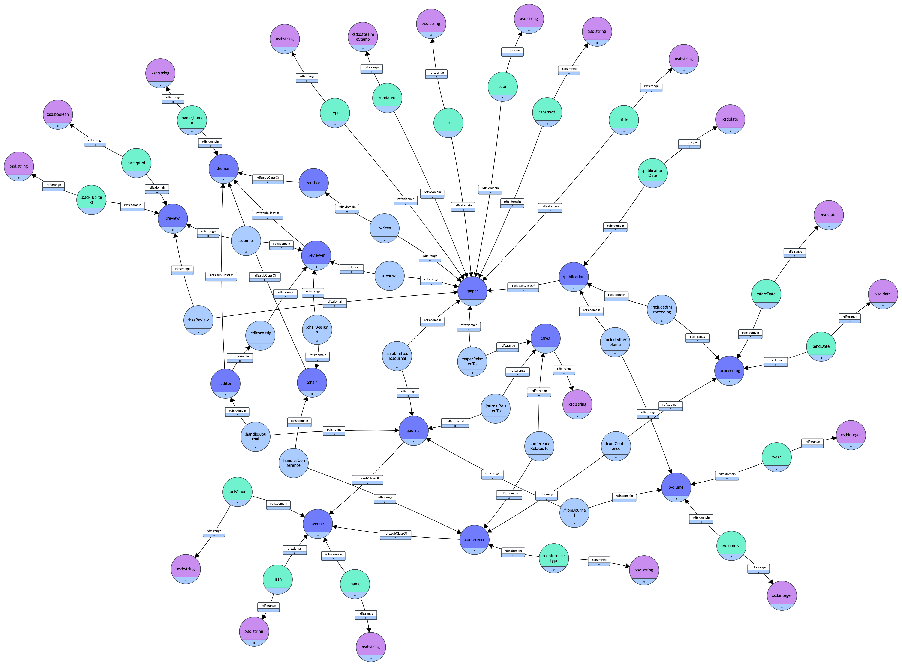

# Q1. Find all Authors
```
PREFIX ex: <http://example.org/>
PREFIX rdf: <http://www.w3.org/1999/02/22-rdf-syntax-ns#>

SELECT DISTINCT ?author_id ?name
WHERE {
   { 
     ?author_id rdf:type ex:author .
     ?author_id ex:name_author ?name .
   }
}
```
# Q2. Find all properties whose domain is Author
```
PREFIX ex: <http://example.org/>
PREFIX rdf: <http://www.w3.org/1999/02/22-rdf-syntax-ns#>
PREFIX rdfs: <http://www.w3.org/2000/01/rdf-schema#>


SELECT DISTINCT ?properties
WHERE {
	?properties rdfs:domain ex:author.
}
```

# Q3. Find all properties whose domain is either Conference or Journal
```

```

# Q4. Find all the papers written by a given author that where published in database conferences.
